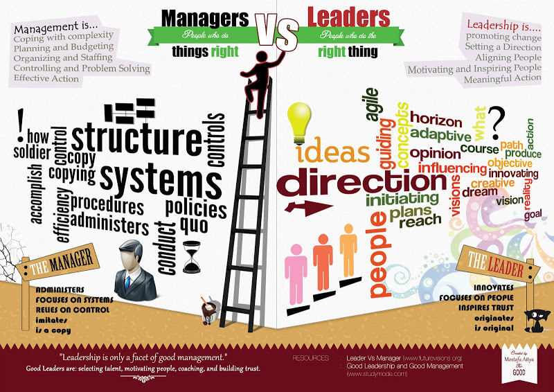

# about.me
This document is intended to give you a clear understanding of me, what my values are, what annoys me and what you can expect. It is also a tool for me to reflect on those aspects. I deliberately use git for this document, so that you are also able to see all changes to this document.

**What is important:** this is not a tool to avoid getting to know me personally. 

# disclaimer
This document only applies to me and in no way should be considered to apply to any other team or manager. 

# biographic facts
I was born in December 1973 in a town called [Bamberg](https://en.wikipedia.org/wiki/Bamberg), which actually is very beautiful and makes me being at life level 0x30 (or for non-tech people: 48). My family runs a company there since 1677 (for 10 generations) which is now run by my brother. The company is in the beer industry, that's why I am pretty interested in beer culture (in addition to drinking it).

After finishing Gymnasium (high school)  I immediately moved to [Karlsruhe](https://en.wikipedia.org/wiki/Karlsruhe) to study computer science. I am pretty proud that I actually got myself a place at that university before I finished my Abitur (high school final exams). Back then Karlsruhe used (and still is) one of the best universities in Germany to study computer science and put a strong focus on mathematics (I actually studied together with the mathematicians), algorithms and theories. 

I finished university in only 4.5 years (2 years faster than average) but missed the possibility to go abroad for some time - something I still regret. After university, my first work was at SONY in Stuttgart. They have one of three research & development plants in Europe there and I did some research in the field of digital audio broadcast (DAB) - or, to be more precise, what other data than audio could be transmitted via a digital broadcast medium. During that time I visited Japan twice and learned a tiny little bit of Japanese. The team was very international, which I enjoyed a lot. 

At that time I was also chairman of Rotaract Germany, a junior division of Rotary International and leading about 150 clubs and 3.500 members. 
Through that social engagement, I met a fascinating woman who lives in Hamburg and therefore I moved to that beautiful city. Today we are married and this was one of the best decisions I made.

In Hamburg I started working at an internet agency - SinnerSchrader - just before the first DotCom bubble exploded. I did engineering work for several retail customers and started using Java for that.

After some time the two ex-founders of getgo.de approached me to create a new startup with me in the role of a CTO. It turned out, this was not the only startup we founded and we become a serial startup company. Some startups were sold again, and some were kept. All IT development was done in-house and the team grew up to 8 engineers. However, I still kept coding and since there are not many people in a startup, I was team lead, architect, developer, sysadmin, and dbadmin all in one.

As my second child was born I took a one-year parental leave. During that time I got to know a couple, who was eager to found a company but was missing someone on the IT side. After parental leave we three founded a company about customer satisfaction: we placed android tablets in retail stores and got continuous feedback from their end customers. I created all IT parts: the software, that runs on the android tablet, web-frontend, database, pdf export. In the 5 years, I was with the company, we grew up to 14 employees and collected millions of customer feedback. However, we had different opinions on how to run the business and I left the company.

In February 2018 I joined XING as a team lead for the Spiderman team, aka ProBusiness in the blue business unit. Since 2019 I additionally lead the ProJobs team, which was created newly (or: re-created) and my main job is to ramp up the team. In 2020 the ProJobs team was merged with the Spiderman team into the ProDucks team. In 2021, management decided to re-create ProJobs and put a completely new team on it, leaving me with ProBusiness product only. In 2022 also the ProBusiness product was discontinued. My team then created the company culture assessment, a nice tool where you can configure your ideal company culture and XING finds matching companies for you (using the data from Kununu). However, this breaking point was for me a sign to move on.

So end of 2022 I started a new career as an Engineering Manager at the International University, the biggest private university in Germany.

We are living in Hamburg Marienthal, my two kids are now 16 (female) and 11 (male) and they both attend school. My wife is an ex-project manager at DER SPIEGEL and is now a freelance artist focusing on textile art. She is an award-winning costume creator and works from home to give our kids and family a firm base until the kids leave our nest. She is my partner in crime and since we met we worked on social projects and other interesting ideas about the world we live in today. For example, we attend the CCC hacker conferences together. 

I am writing this so detail, because there are some key takeaways, that I want you to see:

- I have lots of technical expertise (which I am very proud of).
- I know different sized companies - big and small.
- I already have lived in different life situations - with and without a family, kids, wife, etc. - most likely I can relate with you somehow.

# what my job is about

So my job role is called "team lead engineering". In short: I am here to make sure our team is successful, happy, and working on the things that are most important to help our customers, improve our product, and improve our business. If you are not successful and happy, our team is not successful (or happy).

Let me go into more detail:

## people management

I see part of my job (actually the biggest part) in supporting you, mainly on two levels: the administrative and the personal.

On the administrative side, if you have trouble with some processes, I am very willing to help you. The processes are in place for a good reason, but still, they might not cover all cases. Especially when it comes to vacations **I will assume, that you have asked your teammates** if it is ok for them. I will grant any vacation request as long as you still have enough days left.

On the personal side, I try to give you all means for you to grow. "Grow" in that context means something very individual to you, for some, it is personal growth, for some it is knowledge growth, growing the career, for you it may be something completely different. Whatever it is, I want to give you all the support that I can give.

## leadership

There is a difference between management and leadership - a very fundamental difference. While a manager tries to tell you what to do, a leader tries to help you do what you want. A manager wants to do things right, while a leader wants to do the right things. In that sense, I would like to lead you. In case you feel not led but managed, please approach me.

Again I would also like to make it clear, that I am not the one, deciding on things. You are. The team is. However, as someone else put it: "I am accountable for the decisions the team makes, even if I’m not the one making them."

Another part of the leadership job is to make sure, we are all aligned. Only if we are aligned and going in the same direction, we as a team and as individuals be successful. (There is a great [talk by Dharmesh Shah](https://www.youtube.com/watch?v=i0yqJa48ebs) about that kind of alignment.)

[See below](#my-leadership) for more details on that topic.

## hiring

While you and I cannot do all the work on our own, we need other people to help us. We get those people through hiring. In the hiring process, it is important for me to find a person, who I believe adds to the total balance of the team in many aspects, e.g. skill or personality. In order to find that person, I am strongly led by my gut feeling. It served me well during the last years. 

I might also include you in the hiring process. After all, we are a team and you might need to work with the person later as well.

## executing company strategy

There are some things set up by the company. If I can understand the reason for it and if I consider it valuable, I will try to pursue you to implement that company strategy. However I won't force you to, you still have your own thinking.

If you have a different opinion than I do, this is a welcome topic to talk about with me.

# my values

## humans first

I believe that happy, informed, and productive humans build fantastic products. I optimize for humans. Other leaders will maximize business, technology, or any other number of important facets. Ideological diversity is key to an effective team (as well as gender- and neurodiversity). All perspectives are relevant and we need all these leaders, but my bias is toward building productive humans.

## being empathic

Although we are doing a very technical job dealing with all those 0s and 1s, I strongly believe that in the end much boils down to our feelings and emotions. According to [this study (page 20)](https://static1.squarespace.com/static/53864718e4b07a1635424cdd/t/55de3d9ee4b07afa63281bf2/1440628126432/Apps+Alliance+Global+Developer+Insights+Report+2015.pdf), only 17% percent of IT projects fail because of technical reasons. Therefore I would like to create an environment, where you feel safe to express your feelings and I give you support if you want to explore your emotions. 

## being open

I try hard to treat people as individuals and not to put them into drawers. I know that people have other beliefs than I have and they can keep their beliefs if they want to. If you want to talk with me about your beliefs, I will listen and not condemn you for having a different belief than I do (or that is "socially acceptable"). More likely I will try to understand as much as possible. 

## being honest

I try to be as open and honest as possible. On the other side, I give my best to be polite and will not say all my honesty directly "in your face". Tell me if you don't understand what I am saying.

There may be situations, where I am not allowed to tell you all facts, please respect that. Still, I can tell you my emotions and I try to be as open as possible.

## being fair

I believe that most humans are trying to do the right thing, but unconscious bias leads them astray. I work hard to understand and address my biases because I understand their ability to create inequity.

## healthy life

Many things have been written about "work-life-balance". I don't believe in "work-life-balance". Instead, one has to balance multiple interests - your own and those of others. This sometimes can be really hard. I have been through hard times as well, but I have developed techniques, which work quite well for me and I am willing to share. I also read a lot on that subject.

# my vision

> My vision is to make everybody's work a better place by bringing awareness.

What does that exactly mean? Let's boil it down: I have suffered from work situations, which haven't been good for me. From my past experience, a good or bad workplace is not bound to the physical environment like tables, PC, etc. (it somehow is, but not as much as many people might think), but more to the people with who I work. So I envision a good workplace as a place, where people are aware of each other. That does not necessarily mean, that they are nice to each other, but that they respect the other's needs. Mostly that boils down to the fact, that they respect and/or understand the other's feelings. This is what I mean by being aware of each other.

And how can I accomplish that vision? I can do that, by being aware myself of you and by bringing that awareness to you. I try to set an example and hope, that you will follow me on that sooner or later. This is, in the long run, how I think I can contribute best to that vision. 

# my leadership

## my assumptions
**You’re very good at your job.** You wouldn’t be here if you weren’t, I may have even hired you. If it feels like I’m questioning you it’s most likely because I am trying to gather context. If it still feels awkward to you, tell me.

**I’m not good at your job.** You know best. I’ll work to provide the necessary context and ask questions to help you vent your ideas but I won’t override you.

**You’ll let me know if you can’t do your job.** One of my main responsibilities is ensuring that you’re set up for success. Occasionally things slip through the cracks and I won’t know I’m letting you down.

**You know best, what is good for you,** for your work and for your private life. If it conflicts with me, the company, your environment, or anything else, **I assume that you tell me**. It is ok to make mistakes, it is not ok to cover them up.

## one on ones (1:1)
The most important meeting will be our 1:1s. This is a regular meeting between just you and me. Length, frequency, format, and content are up to you. We’ll start with 30 minutes and then adjust from there.

What is really important for me: **the 1:1 is no status update meeting**. [In the end, it is your meeting! (Follow this link to read more about it.)](https://fellow.app/blog/2020/one-on-one-meetings-with-manager/) You set the agenda. Stuff you may want to talk about is: 

* Discuss this week, what went good for you, and what did not. How did you feel about it? How do you feel about our team and your teammates?
* Are there some action items left from the last meeting?
* What is blocking you now (for your daily work) or in the future (for your career)?
* What are your goals short-term (until the next 1:1) and long-term? Has anything changed?

The best 1:1s I’ve had have focused beyond the moment: Your career development, team strategy, and opportunity, the company's strategy, etc. Feel free to come up with a topic you’d like to discuss.

1:1s should be a safe place. Everything that you tell me (if it is within the official 1:1 round or on some other occasion) is confidential by default and I won't tell anybody. If it comes to a case where I would need to share some information with others (e.g. my superior), I will tell you beforehand. I might also encourage you to share some information with the team, but this is then completely up to you.

If I'm worried about your performance, I will let you know. If you worry that I'm worried about your performance, please let me know.

These are some interesting articles I've read about 1:1s, though I don't necessarily agree with all of the points: [1](https://getlighthouse.com/blog/effective-1-on-1-meetings/), [2](https://medium.com/@mrabkin/the-art-of-the-awkward-1-1-f4e1dcbd1c5c). If you have thoughts on either, that might make a good topic to include in a 1:1.

## your development

Your career is yours. You know best how you’d like to grow and in what areas. I can provide feedback and an outside perspective.

I’ll do my best to provide growth and learning opportunities, it’ll be up to you to seize them. Let’s work together on this.

At the end of the day, it is your career. You set your goals. You set your priorities. Let me know how I can help you achieve them.

## feedback

Feedback works in both directions. 

Giving feedback to you is one of my key things to do. You only can grow, if I give you feedback. If the feedback is supposed to be constructive, I try to frame the feedback. However since we humans tend to see more criticism than positive things, you occasionally might feel bad when getting that kind of constructive feedback. First I encourage you to talk with me about that feeling. Second let me assure you, that I don't want to bring you down. We all make mistakes (me included) and my only intention is to give you guidance to learn from that mistake. I do see the good in you and while we are not all good or all bad (although we want to be and movies try to make us believe that) I still believe in your values, even if it does not feel for you like that in that very moment.

As said, feedback has two directions and I am happy to receive feedback. I realize, that feedback is not always positive and I will frame that accordingly for myself. I strongly encourage you to give feedback to me. If I get too little feedback, I might even ask for it. Remember, I can only change my behavior if I receive feedback. If you are not happy with something I do, I won't change it unless I get some feedback. However, please try to give me feedback in a humble way - I will try to do the same.

Remember, that feedback does not need to be criticism. I would love to hear, what you want me to keep doing. Or what I already do, but could still improve. Even if you think it might not be the case, I do want to hear it. And if you think I don't want to hear it, I'd love to hear why you feel that way.

Feedback works best if given timely close to the occurrence. This applies to both kinds of feedback.

Feedback needs an environment, where both of us feel safe. Therefore I usually go to a closed room with you for the 1:1s or a feedback talk. If you don't feel good, please tell me and we both will look for ways how to create a safe space for you.

I try to organize my feedback with these three steps:

1. What is my reception?
2. What is the impact?
3. What is the desired behavior?

I encourage you, to use the same format because it gives more valuable feedback.

If you can give me feedback in person, I'd prefer that - I will try the same. If you're only comfortable kicking off a discussion with an email or a Teams message, I would rather you do that than not bring it up at all.

If you're not comfortable giving me this feedback yourself, I'd love for you to give it to someone above me in the management chain so they can anonymously relay it to me and I can work on it.

Similarly, if you have feedback for a team member, I encourage you to give it to them directly; if you're not comfortable doing so, please feel free to relay it to me to pass along.

If you want to give direct feedback but aren't sure how or aren't comfortable doing so, let me know and we can talk through it.

## measure
I strongly believe in the sentence "you can only change what you can measure" (by Peter Drucker). I tried measuring my leadership quality but was not successful with it. Currently, I am applying the [4 key metrics](https://tobehh.github.io/talks/4%20key%20metrics/dist/presentation.html) framework for my team with quite some success.

I am also trying to measure the time I am working productively, inspired by [this article](http://hackthesystem.com/blog/why-i-hired-a-girl-on-craigslist-to-slap-me-in-the-face-and-why-it-quadrupled-my-productivity/). I use RescueTime for this.

## doing work
I am following the Getting Things Done (GTD) method to handle all of my tasks. This involves setting goals for myself and following up on them.

If you want to know more about GTD, please read [here](https://gettingthingsdone.com/what-is-gtd/), watch [this video](https://youtu.be/CHxhjDPKfbY), or let's talk in a 1:1 about it.

# usage guide
## how and when to approach me
Very few things are more important than talking to you if you want to talk to me. If you need to talk, let’s talk.

You can approach me at any time, except when I am in focus mode. **You don't have to wait until the next 1:1 is coming up.**

Some weeks, my schedule can be pretty full. On other weeks it's not so bad. If you need to chat, you have a few options.

1. Snag me at my desk. An important thing to know about me: if I have headphones on, it does not mean I am "in the zone" or expect not to be interrupted (I'm probably just enjoying some music). Feel free to grab my attention (preferably by waving in my periphery or tapping my desk—I get a little startled sometimes if someone unexpectedly taps me 😐) If I'm about to have to run off for a meeting or somesuch, I'll let you know and figure out a better time to chat. If I am in focus mode, I will have a red light on - please approach me at a later time or set up a small meeting (see below).
2. Write to me. Even if you want an in-person meeting, message me to let me know you want to talk and I'll make time. If you would rather talk about something over email or message, that's fine too. If I am in focus mode, I will have a red circle next to my status icon. I will not respond during that time, please try again later or wait a little time.
3. Throw something on my calendar. I am also a big fan of lunch dates. My calendar is well-kept, please try to find an open spot there. I know, there are times with a lot of meetings, but there are also times with very few. If you cannot find an open spot, please approach me, e.g. via Teams.

If I'm working from home, you can expect me to be as available as I would be if I was in the office. Although it may feel weird to schedule a brief Teams call when you'd normally just swing by my desk for five minutes, please do so without hesitation if you think chatting face-to-face or screen-sharing will be more useful than textual communication.

You can also try to text me outside of office hours and at the weekend. However, I will take care of myself and my family during that time, and depending on my situation the response time might be very long.

## getting things done

I try to apply the GTD methodology to organize my work. You don't have to know, what that actually is. However, one thing you will experience is, that I will only read my emails twice a day (I try around 10.00 and 15.00 o'clock, but times may vary depending on my calendar). In case you are interested in this methodology, I suggest you the following videos: [Getting Things Done (GTD) by David Allen - Animated Book Summary And Review](https://www.youtube.com/watch?v=gCswMsONkwY), [Getting in control and creating space | David Allen](https://www.youtube.com/watch?v=kOSFxKaqOm4), [The Art of Stress-Free Productivity: David Allen at TEDxClaremontColleges](https://www.youtube.com/watch?v=CHxhjDPKfbY).

If you have further questions or want to apply it for yourself, please approach me.

## work hours

My usual work hours are from 9 a.m. to 6 p.m. Approaching me outside those hours requires some luck to make me respond. Mostly those restrictions are set by my life outside work (e.g. family) and since I want to value their time as well, I will only answer, if I don't steal the time from somebody else. 

Because of that, I may work during strange hours, e.g. at the weekend or late at night. This is my personal choice due to my current life situation. I don't expect you to do the same nor to answer quickly during those off-times. 

Instead, I assume that you know, what is best for you (see above). I truly suggest for you try to stay healthy and look for ways to find balance in your life. Actually, this is really important for me and I know that this sometimes can be really hard.

## meetings
I go to a lot of meetings. I deliberately run with my calendar publicly visible. If you have a question about a meeting on my calendar, ask me. If a meeting is private or confidential, its title and attendees will be hidden from your view. The vast majority of my meetings are neither private nor confidential.

My definition of a meeting includes an agenda and/or intended purpose, the appropriate amount of productive attendees, and a responsible party running the meeting to a schedule. If I am attending a meeting, I’d prefer to start on time. If I am running a meeting, I will start that meeting on time. If it’s not clear to me why I am in a meeting, I will ask for clarification on my attendance.

If you send me a presentation deck a reasonable amount of time before a meeting, I will read it before the meeting and will have my questions ready. If I haven’t read the deck, I will tell you.

If a meeting completes its intended purpose before it’s scheduled to end, let’s give the time back to everyone. If it’s clear the intended goal won’t be achieved in the allotted time, let’s stop the meeting before time is up and determine how to finish the meeting later.

# my expectations of you

1. **Be on time.** I hate to wait. If we have an appointment either be on time or cancel it beforehand.
2. **Be interested.** As long as you are interested and willing to learn, you can go literally everywhere and beyond - and I will help you there.
3. **Be open.** I can only do my job if you are open with me. If you try to hide something from me, chances are high, that in the end, you won't get what you want.
4. **Be honest.** Don't lie to me. I won't lie to you either.
5. **Network.** Go and meet other people, from other teams or outside the company. Tell me, if you need any support.

# nuances

Of course, I also have some nuances and I would like you to know them:

## poker face
It is really hard to tell my emotions from my face. I always seem to have a nice, smiling, calm and relaxed face, no matter what my feelings are. My wife, for the most, is the person who can decipher my microexpressions properly, most others get it wrong. I'm getting better at balancing that by voicing my feelings more openly. However, especially when I don't feel so good, I also tend to speak less. 

## not babble
I tend to speak just the necessary. You may soon notice, that I tend to listen very closely and longer than usual and if I speak, the words usually do have some meaning. 

I don't think, this is something you need to take care of, just something you need to be aware of if you see me for the first time.

## more of an introvert

Like in many things in life, there's a long scale between being introversive or extroversive. I definitely am more on the introversive side, which luckily does not mean I am anti-social. It just means I enjoy observing more than speaking.

## depression
I had a depression/burnout phase some years ago, even with clinical treatment. Since then, I've done some thorough work on it and have found a balanced way to deal with it by implementing practices in mindfulness, self-reflection, healthy nutrition, and regular sports (running) as well as mild medication into my daily life. I am mentioning this because I want to be open about it and encourage others to do the same. I believe this has made me the emphatic and tolerant person I am today. Depression is largely genetic and is also the reason, why I am so honest with other people. (The keyword here is: neurodiversity (which also includes Asperger, Autism, Triple-X, Depression, etc.) - in addition to gender diversity.) It is nothing to be ashamed of. Today we, fortunately, live in an open-minded time where there is a lot of appreciation for the virtues, neurodiverse people have.

## biased toward action
I strongly dislike long discussions. I merely like to start quickly and iterate on the results. However, I know, that especially in a team, it is highly valuable to discuss things first. If I am biased toward action too much, please tell me (and stop me).

When I ask you to do something that feels poorly defined, you should ask me for both clarification and a call on importance. I might still be brainstorming. These questions can save everyone a lot of time.

I love to start new things but I often lose interest when I can envision, how the task is going to finish which might be weeks or months before the objective is actually done. If this takes place and you have a different opinion about the outcome, I would appreciate hearing about it.

## ask me
When you need to ask me to do something, ask me. I respond incredibly well when being asked like: “Tobias, can you help with X?”. I respond poorly to being ordered what to do, like: “Tobias, do X.”.

# hobbies

I am very interested in hardware and - if I have some time I try to tinker stuff with an Arduino. Please approach me, if you are interested in that. I also love to attend the CCC conferences with my wife and kids.

I like traveling a lot. I have been to more than 50 countries now. The rate of exploring new countries dropped significantly as I got kids. But we are about to ramp it up again. Since my wife is a frequent traveler with a huge, worldwide network too, and the kids seem to have picked up on our joy to explore places and culture (by mostly staying with locals instead of hotels).

I run half marathons. Sometimes I run around the Alster lake during lunchtime. You're welcome to join me on that. I don't run fast (around 7 minutes/km), I run for fun.

I do a lot of photography. However, I hardly use my DSLR anymore and do mostly all my photos with my mobile phone (which I choose by the camera quality). I publish my photos on [https://www.instagram.com/schulzhess/](Instagram).

# caveat

Take this document with a grain of salt: I wrote it! I have never experienced having myself as a manager. If I'm your TL and something here seems off, open a pull request or issue, or (probably more comfortably) bring it up to me in one-on-one or over Teams.

While writing, I was inspired by some great ideas from [https://hackernoon.com/12-manager-readmes-from-silicon-valleys-top-tech-companies-26588a660afe]() and the readmes, which are linked there. Some sentences are copied but still are my own view.